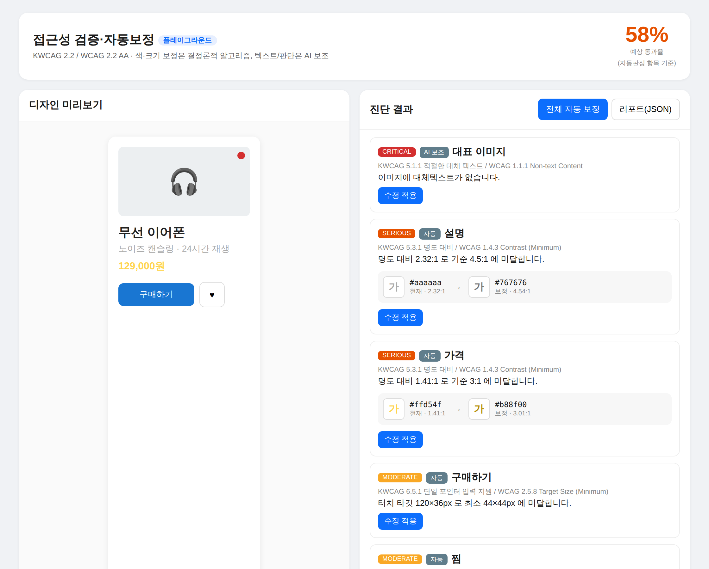
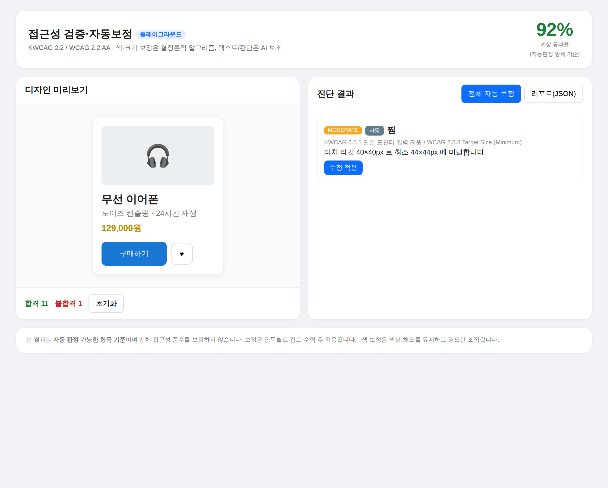

# 베리어프리 접근성 검증·자동보정 플랫폼 — 사용 설명서

> 지금까지 개발된 것이 **무엇을 할 수 있는지**, **어떤 기능**이 있고 **어떤 화면**으로 동작하며, **어디에 쓰이는지**를 정리한 문서입니다.
> 기준: KWCAG 2.2 / WCAG 2.2 AA · 대상: 디자이너, 퍼블리셔/개발자, 접근성 담당자.

---

## 1. 한 줄 요약

> **디자인·화면이 "장애가 있는 사람도 쓸 수 있는지"를 자동으로 검사하고, 브랜드 톤을 해치지 않는 선에서 색·크기를 자동으로 고쳐주는 도구.**

- 색·크기 보정은 **결정론적 알고리즘**(수학 공식)으로 — 결과가 항상 일정하고 디자인이 망가지지 않음.
- 대체텍스트·레이블 같은 **문맥 판단**은 AI 보조로 — 사람이 최종 검토·수락.
- "접근성 100% 보장" 같은 **단정 표현을 쓰지 않음**(FTC accessiBe 시정명령 사례 반영). 항상 "자동판정 항목 기준"임을 명시.

---

## 2. 지금 할 수 있는 것 (구현 완료 — Phase 1)

| 기능 | 설명 | 자동 보정 |
|---|---|---|
| **텍스트 명도 대비** | 글자색과 배경색의 대비가 기준(일반 4.5:1, 큰글씨 3:1) 이상인지 | ✅ 색 |
| **UI 요소·아이콘 대비** | 아이콘·입력 테두리 등 비텍스트 요소 3:1 | ✅ 색 |
| **터치 타깃 크기** | 버튼·링크가 44×44px 이상인지 (모바일·키오스크) | ✅ 크기 |
| **최소 글자 크기** | 본문이 너무 작지 않은지 | ✅ 크기 |
| **이미지 대체텍스트** | 의미 있는 이미지에 alt가 있는지 (장식 제외) | ⚠️ AI 생성 제안 |
| **컨트롤 레이블** | 버튼·입력에 접근 가능한 이름이 있는지 | ⚠️ AI 생성 제안 |
| **포커스 표시** | 키보드 포커스 시 가시적 표시가 있는지 | ✅ 스타일 |
| **리포트 출력** | 진단 결과를 JSON/텍스트로 — 출처(자동/AI/수동) 구분 | — |

핵심 차별 기능은 **"스타일 유지 색 보정"** 입니다. 대비가 부족한 색을 검정/흰색으로 갈아엎는 게 아니라, **색상(Hue)·채도(Chroma)는 그대로 두고 명도(Lightness)만** 조정해 "통과하는 가장 가까운 색"을 찾습니다. 노란색은 노란 톤, 파란색은 파란 톤을 유지합니다.

```
#aaaaaa (연회색) 2.32:1  →  #767676  4.54:1   (명도만 조정)
#ffd54f (노랑)   1.41:1  →  #987000  4.51:1   (노랑 톤 유지)
#1976d2 (파랑)   2.63:1  →  #004ea7  4.53:1   (파랑 톤 유지)
```

모든 보정 색은 **적용 후 다시 대비를 계산해 기준 통과를 재검증**합니다(자기검증 루프).

---

## 3. 화면 (실제 동작)

### 3.1 보정 전 — 진단 결과

상품 카드 예시를 진단한 화면입니다. 왼쪽은 **실제 렌더 미리보기**, 오른쪽은 **항목별 진단 결과**입니다. 연회색 설명글·노란 가격은 대비 미달, 대표 이미지는 alt 없음(critical), 구매 버튼은 44px 미만으로 잡혔고, 예상 통과율은 **58%**.



각 항목 카드에는 ▲심각도(critical/serious/moderate), ▲판정 출처(자동/AI 보조), ▲근거 기준(`KWCAG x / WCAG y`), ▲설명, ▲**색 보정 미리보기(현재 색 → 보정 색, 대비 수치 포함)**, ▲[수정 적용] 버튼이 표시됩니다.

### 3.2 보정 후 — 전체 자동 보정 적용

"전체 자동 보정"을 누르면 색·크기·alt가 한 번에 반영되고, 미리보기의 디자인이 즉시 바뀝니다. 설명글·가격이 읽기 쉬운 색으로 바뀌고, 통과율이 **92%**로 올라갑니다. 남은 1건(찜 버튼 크기)처럼 **판단이 필요한 항목은 자동으로 끝내지 않고 남겨** 사람이 결정하도록 합니다 — 과장 없는 설계입니다.



---

## 4. 어디에 쓰이나 (활용 시나리오)

### 4.1 디자이너 — 디자인 단계에서 미리 잡기 (Figma 플러그인)
- Figma에서 프레임을 선택하고 플러그인 실행 → 접근성 위반을 **개발 전에** 발견.
- 색 대비 미달을 **브랜드 색을 유지한 채** 한 번에 보정. 가능하면 **디자인 토큰(Variables)** 으로 치환.
- 효과: QA·재작업 비용 절감, 접근성 지침 준수를 디자인 기본값으로.

### 4.2 퍼블리셔/개발자 — 납품 전 셀프 점검
- 콘솔 데모(`pnpm --filter @app/core demo`)나 웹 플레이그라운드로 색·크기 기준을 빠르게 확인.
- JSON 리포트를 산출물에 첨부해 **객관적 근거**로 활용.

### 4.3 공공·금융·커머스 — 법적/계약 요구 대응
- 전자정부·공공기관 웹/앱은 접근성 준수가 의무. 자동 판정 가능한 항목을 선제적으로 정리.
- **키오스크**(Phase 3 예정): 고령자·장애인 사용이 많은 무인 단말의 터치 타깃·대비를 강제 검증.

### 4.4 접근성 담당자/감리 — 리포트 기반 커뮤니케이션
- `자동 / AI 보조 / 수동` 출처가 구분된 리포트로, "무엇이 기계로 확인됐고 무엇이 사람 확인이 필요한지"를 명확히 보고.

> ⚠️ **한계(중요)**: 자동 판정은 전체 접근성 기준의 **일부**입니다. 키보드 조작 흐름, 화면낭독기 읽기 순서, 콘텐츠 의미 등은 사람의 수동 점검이 필요하며, 본 도구는 그 부분을 `manual`로 분류해 가이드만 제공합니다.

---

## 5. 직접 해보기

### 5.1 엔진/리포트 — 가장 빠름 (Figma 불필요)
```bash
cd a11y-platform
pnpm install
pnpm --filter @app/core demo     # 가상 화면 진단 + 색 보정 + 리포트 출력
pnpm --filter @app/core test      # 단위 테스트 30개
```

### 5.2 웹 플레이그라운드 — 브라우저에서 클릭으로 체험
```bash
pnpm --filter @app/playground dev      # 개발 서버
# 또는
pnpm --filter @app/playground build    # dist/index.html (단일 파일) → 더블클릭으로 열기
```
색을 바꾸고 [수정 적용]/[전체 자동 보정]/[리포트(JSON)]을 눌러보는 위 3장의 화면이 이 플레이그라운드입니다. 인터넷·서버 없이 동작합니다.

### 5.3 Figma 플러그인 — 실제 디자인 검사
```bash
pnpm --filter @app/figma-plugin build  # dist/code.js + dist/index.html 생성
```
Figma 데스크톱 → Plugins → Development → **Import plugin from manifest** → `packages/figma-plugin/manifest.json` 선택.
(Figma 데스크톱 앱이 설치된 로컬 PC에서 진행)

---

## 6. 향후 계획

| 단계 | 내용 | 상태 |
|---|---|---|
| **Phase 1** | Figma 플러그인 (디자인 단계 진단·보정) | ✅ 구현 완료 |
| **Phase 2** | 웹 대시보드 + 백엔드, HTML/URL 검사(axe-core), AI 대체텍스트 생성 | 🔜 인터페이스 설계됨 |
| **Phase 3** | 키오스크 빌더 (NIA 디자인 시스템 기반 접근성 통과 화면 생성) | 🔜 예정 |

---

## 7. 신뢰성·검증 현황
- 색대비 계산은 WCAG 공식과 **±0.01 이내** 일치(검증 케이스 테스트).
- 모든 자동 색 보정은 적용 후 **재검증 통과** 확인.
- 코어 단위 테스트 **30개 통과**, 타입체크 클린, 플러그인·플레이그라운드 빌드 산출물 생성 확인.
