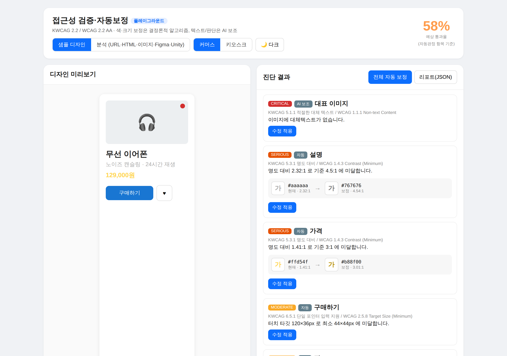
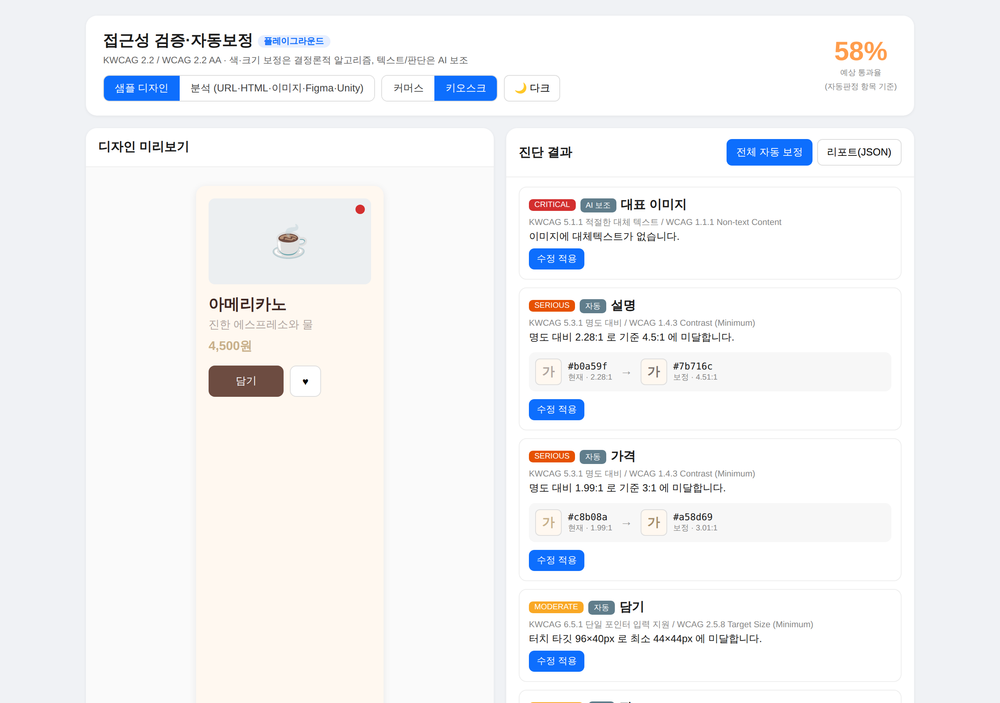
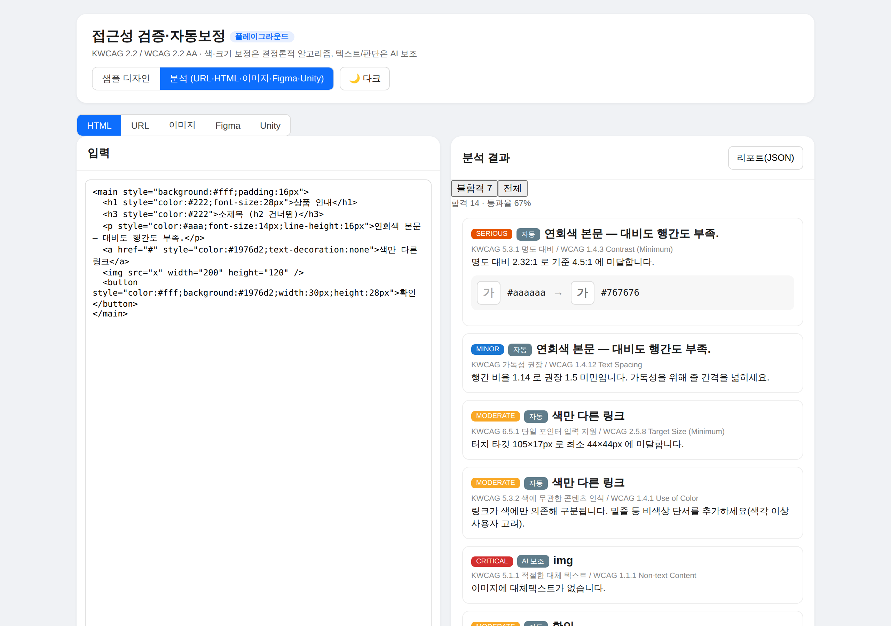
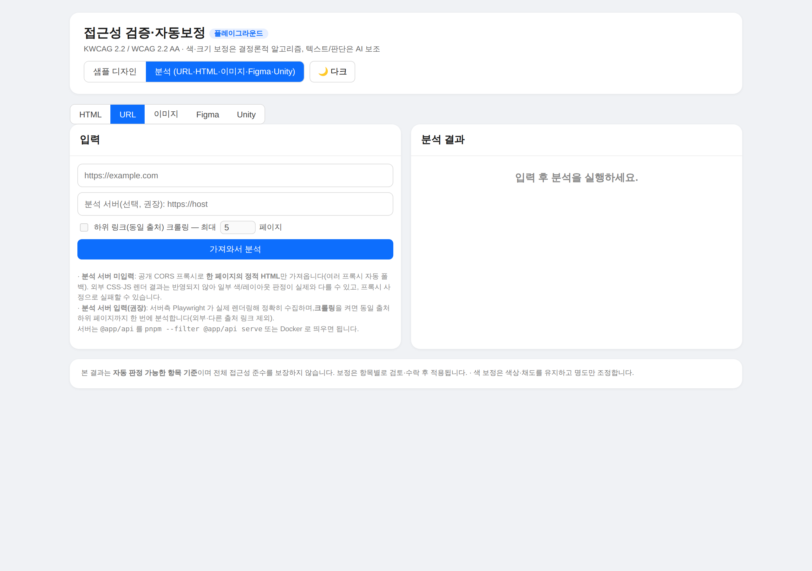
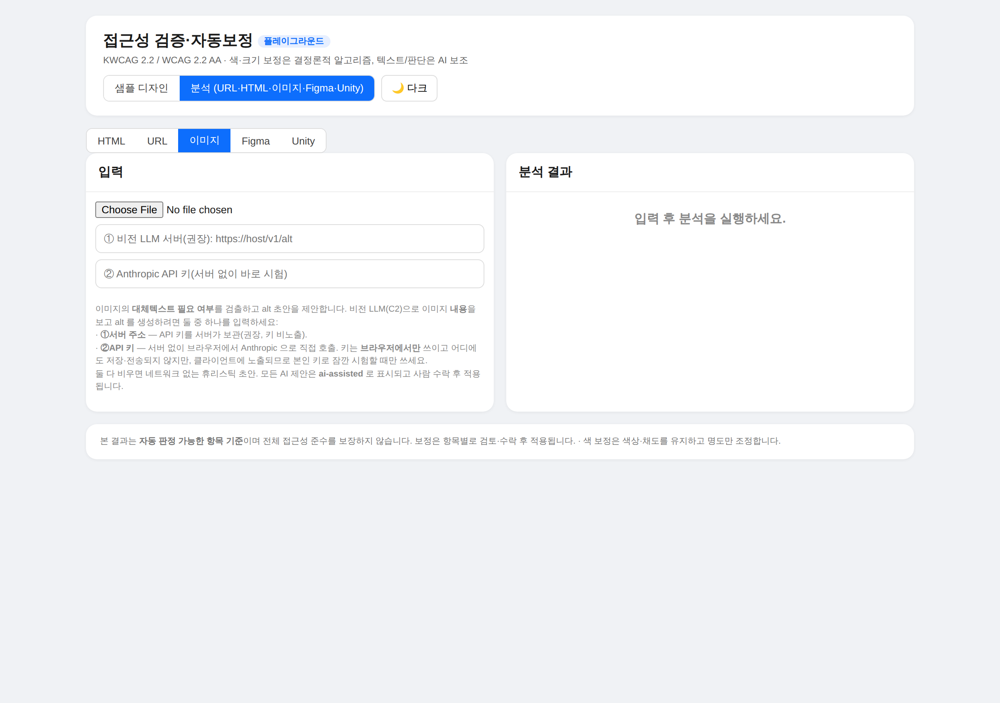
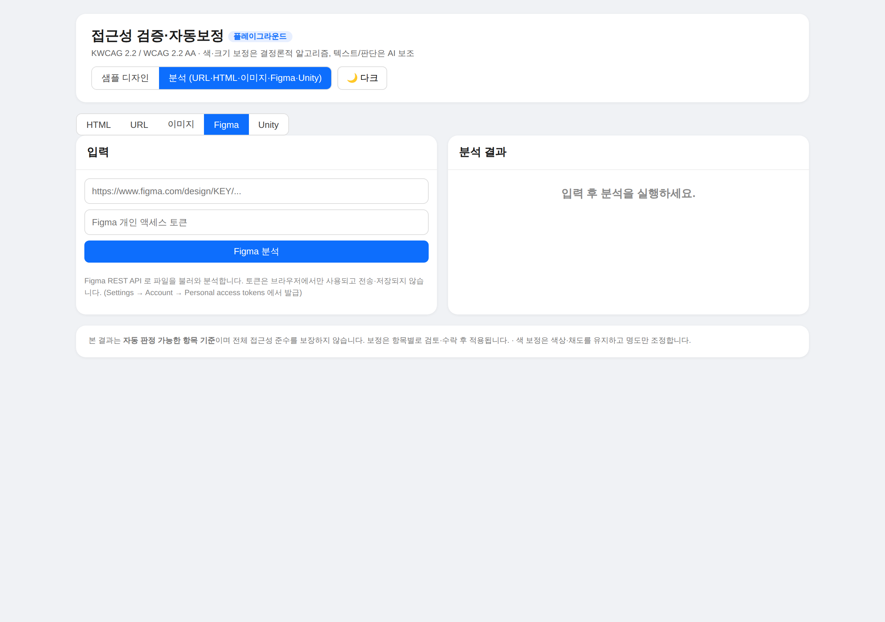
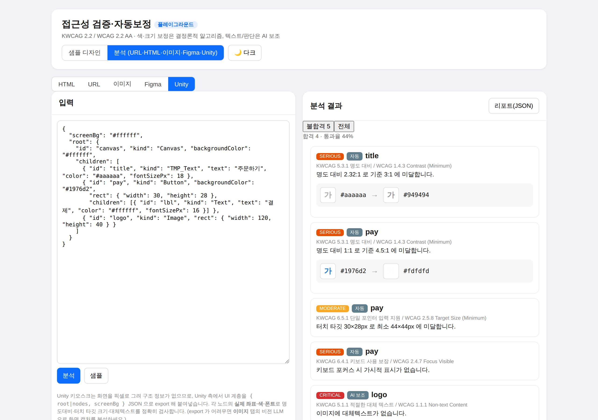

# 사용 설명서 — 베리어프리 접근성 검증·자동보정 플랫폼

KWCAG 2.2 / WCAG 2.2 AA 기준으로 디자인·화면의 접근성을 **자동 진단**하고, 브랜드 톤을
해치지 않는 선에서 **색·크기를 결정론적으로 보정**하는 도구입니다. 대체텍스트·문맥 판단만 AI 가
보조하고, 모든 보정은 사람이 항목별로 수락한 뒤 적용됩니다.

> ⚠️ 본 도구의 자동 판정은 **자동 판정 가능한 항목 기준**이며, 전체 접근성 준수나 인증 통과를
> 보장하지 않습니다. 음성 안내·물리 접근 등은 수동(`manual`) 점검 항목으로 분류됩니다.

---

## 1. 한눈에 보기 — 두 가지 사용 모드

상단 토글로 **샘플 디자인**(체험·시연)과 **분석**(실제 입력 검사)을 전환합니다.

| 모드 | 용도 |
|---|---|
| **샘플 디자인** | 내장된 커머스/키오스크 예시를 실시간 편집하며 진단·보정을 체험 |
| **분석 (URL·HTML·이미지·Figma·Unity)** | 실제 화면/디자인을 5가지 방식으로 입력해 검사 |

---

## 2. 샘플 디자인 모드



- **왼쪽**: 디자인 미리보기(편집 가능). 상단에서 **커머스 / 키오스크** 프리셋, **다크** 모드 전환.
- **오른쪽**: 실시간 진단 결과. 각 항목은 **심각도**(critical/serious/moderate/minor)와
  **출처 배지**(자동 / AI 보조 / 수동)로 구분됩니다.
- 우상단 **예상 통과율**은 "자동판정 항목 기준" 임을 항상 표기합니다.
- 색 대비 미달 항목은 **현재색 → 보정색**(명도만 조정, 색상·채도 유지)을 미리보기하고,
  **수정 적용**으로 항목별 반영합니다. **전체 자동 보정**으로 일괄 적용도 가능합니다.



키오스크 프리셋은 큰 터치 타깃·고대비가 중요한 무인단말 시나리오를 가정합니다.

---

## 3. 분석 모드

5개 입력 탭(HTML · URL · 이미지 · Figma · Unity)을 제공합니다. 결과 패널의 **리포트(JSON)**
버튼으로 진단 결과를 내보낼 수 있습니다.

### 3.1 HTML 탭



HTML 코드를 붙여넣고 **분석**을 누르면 브라우저에서 바로 검사합니다(네트워크 불필요).
명도 대비·글자 크기·행간/자간·링크 식별성·제목 구조·대체텍스트 등을 한 번에 점검합니다.

### 3.2 URL 탭



- **분석 서버 미입력**: 공개 CORS 프록시로 **한 페이지의 정적 HTML**만 가져옵니다(여러 프록시 자동 폴백).
  외부 CSS·JS 렌더 결과는 반영되지 않아 일부 판정이 실제와 다를 수 있습니다.
- **분석 서버 입력(권장)**: 서버측 Playwright 가 실제 렌더링해 정확히 수집합니다.
  **하위 링크(동일 출처) 크롤링**을 켜면 최대 N페이지를 한 번에 분석합니다(외부·다른 출처 링크 제외).
- 분석 서버는 `pnpm --filter @app/api serve` 또는 Docker 로 띄웁니다(로컬 `http://localhost:3001` 도 가능).

### 3.3 이미지 탭



이미지의 **대체텍스트 필요 여부**를 검출하고 alt 초안을 제안합니다. 이미지 **내용**을 보고
alt 를 생성하려면(비전 LLM, C2) 둘 중 하나를 입력합니다:

1. **① 비전 LLM 서버** — API 키를 서버가 보관(권장, 키 비노출)
2. **② Anthropic API 키** — 서버 없이 브라우저에서 직접 호출(본인 키 즉석 시험용; 키는 브라우저에서만 사용)

둘 다 비우면 네트워크 없는 휴리스틱 초안으로 처리합니다. 모든 AI 제안은 `ai-assisted` 로
표시되고 신뢰도와 함께 제공되며, 사람이 수락한 뒤 적용됩니다.

### 3.4 Figma 탭



Figma 파일 URL 과 개인 액세스 토큰으로 REST API 에서 파일을 받아 분석합니다.
토큰은 브라우저에서만 사용되고 전송·저장되지 않습니다.

### 3.5 Unity 탭 (키오스크)



Unity 는 화면을 픽셀로 그려 구조 정보가 없으므로, Unity 측에서 UI 계층을
`{ root|nodes, screenBg }` JSON 으로 export 해 붙여넣습니다. 각 노드의 **실제 좌표·색·폰트**로
명도대비·터치 타깃 크기·대체텍스트를 정확히 검사합니다.

- 바로 쓰는 export 스크립트: [`../examples/unity/A11yUnityExporter.cs`](../examples/unity/A11yUnityExporter.cs)
- export 가 어려우면 화면을 캡처해 **이미지** 탭의 비전 LLM 으로 분석하세요.
- 자세한 형식·한계·수동 점검 항목: [`UNITY_KIOSK.md`](./UNITY_KIOSK.md)

---

## 4. 결과 읽는 법

- **심각도** — critical > serious > moderate > minor
- **출처 배지** — `자동`(결정론), `AI 보조`(ai-assisted, 사람 검토 전제), `수동`(manual, 사람 점검 필요)
- **확인필요 배지** — 휴리스틱 기반 저신뢰 판정. 반드시 사람이 확인
- **보정 미리보기** — 색: 현재 → 보정(명도만 조정), 크기/포커스 등은 제안값 표기
- **불합격 N / 전체** 필터로 실패 항목만 보거나 전체를 봅니다.

---

## 5. 분석 서버(선택)

URL 정밀·크롤링, 서버 보관형 비전 LLM 을 쓰려면 분석 서버가 필요합니다.

```bash
cd a11y-platform && pnpm --filter @app/api serve          # http://localhost:3001
# 또는 Docker
ANTHROPIC_API_KEY=sk-... docker compose up --build
```

- 엔드포인트: `POST /v1/scan` · `/v1/crawl` · `/v1/fix` · `/v1/report` · `/v1/alt`
- 원클릭 배포(Render) 및 로컬 사용법: 루트 [`README`](../../README.md) 참고.

자세한 기능 정의는 [기능정의서](./FEATURE_SPEC.md)를 참고하세요.
